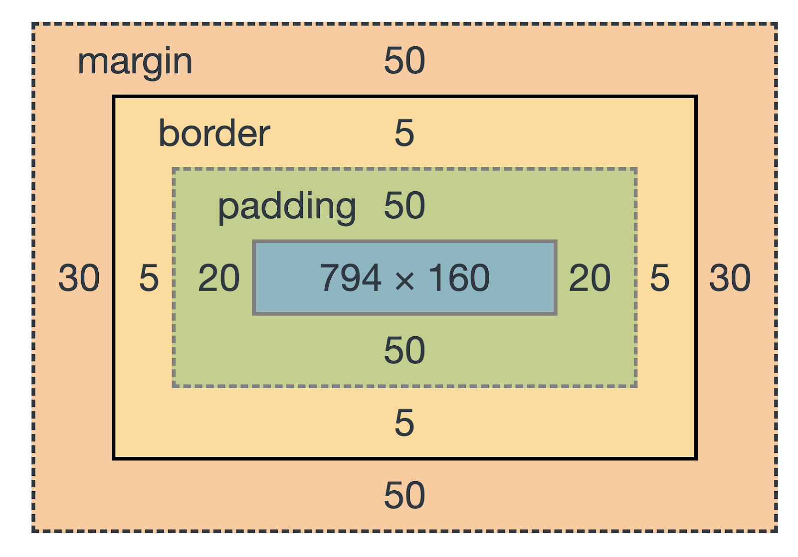

# CSS

---

**Cascading Style Sheets**

## Inline CSS

There is a style attribute in HTML that can style that particular element

Eg:

```HTML
<body style="background-colur: blue">
...
</body>
```

This way of styling is more hectic and error prone

## Internal CSS

By default all the elements in HTML are styled with the defualt style of the browser [Find default style here](https://www.w3schools.com/cssref/css_default_values.asp)


Style could be applied to elements by using the `style` tag in the head section

```HTML
<head>
<style>

hr{
    background-color: red;
}
<!---
This chanegs all the he elements in the page to red
--->
</style>
</head>
```

> All the elements in the HTML are essentially boxes

## External CSS

You can place the style of the code in seperate file and link it to the HTML file

**To Link** :

```HTML
<head>
<link rel="stylesheet" href="css/styls.css">
</head>
```
**In styles.css**

```
Place all the styling in your external css file
```

The order of priority is :

> id selectors > class selectors Inline CSS > Internal CSS > External CSS

**The best practise is to use external CSS**

## CSS Syntax

```
selector {property : value ;}
```
**selector** : Who?

**property**: What?

**value**: How?

Note: It is recommended to place the properties in alphabetical orders

The list of exhaustive CSS properties can be found here : [CSS Properties](https://developer.mozilla.org/en-US/docs/Web/CSS/Reference)

## CSS Class Selectors

Every HTML tag has a `class` attribute 

You can use this to style only the elements that have the same class

A html tag can have multiple classes seperated by space

```HTML
<h1 class="class1 class2">
This is a heading
</h1>
```
It will be styled according to both the classes

**CSS Syntax**

(assume that there is a class called bacon)
```
.bacon{
    color:red;
}
```

Divide the style sheets into two parts : 
1. `TAG SELECTORS`
2. `CLASS SELECTORS`

## CSS Comments

`/* This is a comment */` 

## `class` vs `id`

1. There can only be one html element with a given `id` name whereas there can be multiple tags with the same `class` name

2. A given `html` element can have multiple `class` names but only one `id` name

**CSS Syntax**
```
#heading {
    color: red;
}
```
## CSS Pseudo-Classes

HTML elements can have states like : hover, i.e., The state of the HTML tag when it is hovered.

**CSS Syntax**
```
img:hover{
    border: 1px solid red;
}
```

This will decide the style of the image when it is hovered

## Favicon

Favicon : Favicon is a small icon that is displayed in the address bar of the browser ( Faviorite iocn )

**Linking Favicon Syntax**
```HTML
<head>
    <link rel="icon" href="favicon.ico">
</head>
```

## The Box Model



There are 4 boxes in the box model:

1. The content box : Contents of the element reside in the box
2. The padding box : This pads the content box to the border creating a space
3. The border box: Gives a border to the padding box, by default has a width of 3px
4. The margin box : The final box, that seperates the elements from other elements

```
/* For content box */
{height: 100px;}
{width: 100%;}

/* For border box */
{border: solid ;}
{border-width: 50px;}
{border-top : 50px;}
{border-width: 0px 10px 20px 30px;}

/* padding */
{padding: 20px;}

/* margin */
{margin: 10px;}
```
## CSS Display ( The display property )

The position of an element can is determined by a lot of factors some of them being the margins, paddding, border etc.. Adding to the list of factors is the display property of an element

There are four types of display in css :

1. **Block** : These elements block ( takes up the whole width available ) and always starts on a new line, they have top and bottom margins. They can have a height and width.

Eg: 

* Paragraphs (`<p>`)
* Headers (`<h1>` to `<h6>`)
* Divisions(`<div>`)
* Lists and list items (`<ol>`, `<ul>`, `<li>`)
* Forms (`<form>`)

2. **Inline** : Takes up only as much width as necessary. Width and height have no effect on these elements.

Eg:

* Spans(`<span>`)
* Images(``)
* Anchors(`<a>`)

3. **inline-block** : Best of both worlds, width and height properties still work on these elements.

4. **None** : These elements are not displayed, can be used when you need to hide the whole element, equivalent to removing the elements

Note: you can change the dislay property from its default value in css

**CSS Syntax**

```
p{
    display: block;
}

h1{
    display:inline;
}

h3{
    display: inline-block;
}
```

## CSS Positioing 

Default CSS positioning follows the following rules

1. Content is Everything : The height of the block elements is determined by the content in the block

2. Order Comes From HTML Code : Obvious point

3. Childern sit on the tag: A z-axis pov, children are more towards th user

### The position property 

1. **static** : Default rules when gone with HTML flow

2. **relative** : The element if positioned relative to its parent. Note that this is like a ghost of the original element that floats in the screen. The space taken by the default element is unchanged.

**Coordinates** : `right`, `left`, `top`, `bottom`

Consider them like margins( for understanding )

```
div{
    position: relative;
    left: 20px;
}


